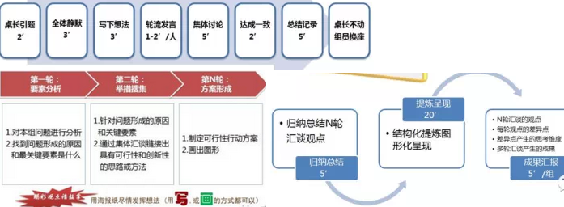
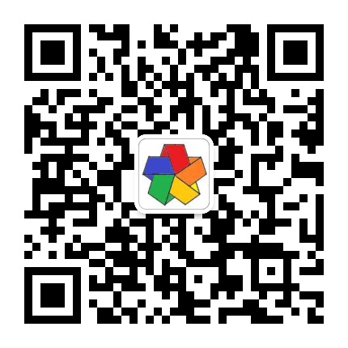

【源计划】第一次研讨会
----------------------------

> 时间地点：9月25日 周日 下午 13:30-16:30（计划）  
> 上海徐汇斜土路2611号嘉汇国际广场T2栋  
> 联系人：赵振华--187 2196 5087  

## 【源计划】第一次会议总结（世界咖啡）

> 热爱胜于金钱：动机、情感、激励；  
  发挥群体力量： 分享、合作和集体行动；  
  建立网络规则：承诺、工具和协议。

- 主要内容：

  * 共10位群友参加，@乡土老农（山东赶来不易），有幸认识多位专家，收获很大（前辈的经验），大家都很积极，有参与感。问题：汇谈控制不是很好，想法表达不清（想表达的东西有点多战线太长）、情景前提设定的不好主题分散（再来一次机会的话讲：为什么从PKM到AI），但有点像项目批判教育会，大家注意力可能都被吸引走了，没有形成预期共识、具体产出。可随时查看相关开源项目文档，欢迎各种形式的改进意见。未分享的一些话题后期在群中讨论。

  * 明确的是：社群开放合作共赢，是实现本项目的通用知识智能助理相对可行的方式，基于共同的信念利益为自己开发产品，支持协同学习分享平台。集体智慧+多元知识+信息技术=>核心语义元+智能结构+知识图谱库=>AI。 而商业资本需要的是明确的市场痛点现金流，会带来很多约束，开发也是集中式的满足别人的需求，既不能吸引足够多的人参与也不能自由发展，这本身就是在尝试一种新的生产关系（比开源更密切、面向未来）。如何发挥凝聚建设社群是首要任务，发挥团队力量，一个看领导者对战略方向的掌控、资源整合能力，再一个就是大家的积极主动性，贡献智慧，希望每个人都作为合伙人参与，当成自己的一项事业。是基于共同的兴趣信念一个自组织共赢智慧涌现的形式，不是一个人能全面管控的，社群也是项目的产品之一。项目还要继续完善，只要有一个人就不会散，请第一次确认加入合伙的举手（业余协作，第一批有贡献积分奖励！） 贡献积分是个体对组织的贡献衡量，未来分配的主要指标。下一步迭代开始进行具体解决方案设计，试着开发智能核心（元理论+机器学习+本体语义关联理解表示推理生成交互学习）。参与贡献、文末有产品技术+全面todolist，可供选择!选择一个方向并可互相学习。
  * 创新点核心竞争力：社群模式、哲学思考、理论假设、理解自省发现模式的能力。

  * 初期整体目标：首先统一认识，开发工具支持成员知识管理（主要是智能交互+知识可视化+协同编辑+知识共享、能力互补、隐性知识、原则方法论（如GTD、整体学习法等）的 显化结构化标准化智能化、形成高效认知学习协同机制（集群智能准备）、真正发挥团队力量（人类计算）），进行知识及技术积累、理论完善。 协同挖掘通用语义元，重建知识体系（语义元+时空+概念层次结构+关联性），智能结构（自省人类能力 ），是从本源上重建系统整体。积累完善技术+理论，为实现更加智能的工具做准备。用具体技术描述就是：结合复杂系统科学+人类计算+增强迁移深度机器学习+分布式+NLP+SDN+区块链+知识工程=智能模拟+语义网+聊天机器人。

  * 项目初期还比较简陋，看起来有点空想（AI本身就是一件远、难、坑的事情，我们也是先挖个大坑，坑就是核心竞争力，有挑战才有机遇，就是做别人认为不可能，不能或不愿实现的。有假设有革新赌一把，尽力而为，才有超越的机会），也是希望能集合大家的力量各位专家参与改进、尽量多提假设性意见。而不仅是发现问题！

- 再明确一下社群定位：

  * 基础认识：所有能被认知及表达的都是知识，从基本的感知认知、语义元、知识体系、到世界观价值观，知识管理不仅是知识管理！时间精力注意力甚至是情感的管理，辅助分析预测决策。（用知识管理可能误导了大家，知识工程可能好些）。知识经济：知识知识取代土地、劳动、资本与机器设备，成为最重要的生产因素。 个人知识管理行业，市场空白有先发优势，需求有待开发（但有望超越衣食住行成为高层次强需求，可以用到任何行业），好奇心、求知、活到老学到老！重要的是创造性知识、人生智慧。知识管理+NLP+AI（相辅相成），智能系统建模非从物质形式（如仿生、神经网络），是可基于当前操作系统实现的更高层次的整体抽象智能系统，未来可发展OS，领养自己的智能朋友。可能每一项您都认为是不可能，我们的就是要一步步把它实现！
  * 从个人知识管理切入，关注知识管理的整个过程，更注重挖掘本质根源、关联性、统一体系，基于统一语义元、结构体系的个性化知识智能助理，知识工程实践，分布式智能化的协同学习知识整合创新分享。挖掘隐性知识、方法论、原则、知识的整合自动化、提醒引导、智能交互。时间精力的管理，个人应用接口，探索知识及智能本质，模拟实现类人智能！
  * 初期计划0盈利（收获朋友、知识、工具、技能、贡献积分），不接受商业资本控制 ，从根本去解决问题革新突破，相信并探索可能性，从0到1，若能成功就是跨越式发展（颠覆），请相信自己的眼光，从心而为，付出就有收获。按贡献分配，真正的合伙人是一起解决问题，社群是自己的社群 。所有初期参与开发的送3000永久贡献积分（3年成熟）。已经思考大体解决方案，可行性分析，还需要具有相同信念的合伙人一起，探索具体解决方案并迭代实现。探索提供一个整体的解决方案（不可分离、是不变战略），有重点的迭代实现（我们是程序员实践创新者非研究，以实用解决问题为主，自己即用户）。闭环正反馈递归迭代能变更好可持续。
  * 目的意义愿景战略路线目标信念的整体描述：知识经济（背景）、大道至简（统一性）、以人为本（意义），首先扩展个人的能力（工具+协同，社群内部验证），社群开放合作共赢（方式，基于项目学习型），从知识管理到人工智能（战略路线，要实现应对AI，我们需要学习知识也是智能的基础，将来智能也是分布式类人协同的（协同机制），我们是建设训练智能），挖掘知识及智能本质，建立通用语义元、知识体系、智能结构、协同机制（核心根本），目标是跨学科融合创新、实现集群通用智能。发扬传承智慧，自由平等幸福（理念）！

- **提醒**

  * 新手及专家（类似初创和大公司）：新手出生牛犊不怕虎，具有更多可能性灵活性（有利于自省学习能力，更多选择性），缺乏经验，三个臭皮匠赛过诸葛亮，想高效学习积累请参与本项目；专家有积累优势，但易过拟合思维定势，顾虑，想解放大脑请参与本项目，建立体系分享给新人后代。都要要开放思想、谦虚好学、结合互补纵横扩展。

- 需求痛点

  * 好奇求知、知识过拟合（横向发展）、知识爆炸碎片化无统一结构体系浪费时间精力（统一源、入口、显性化结构化标准化流程化自动化可视化智能化交互，数据信息知识到智慧的转变）、与智能相辅相成（智能理论、知识库、学习拟人训练）、教育培训需求（挖掘隐性知识能力、统一基础知识图谱分享、游戏化）、个人能力有限，扩展人的能力（收集输入存储更新可视化智能交互辅助mece、抽象语法）、专注于知识及智能本质（通用语义元，智能结构）、协同问题（协同机制自组织涌现）、知识管理传承智慧问题（知识大数据，整体关联可视化仿真），本末倒置缘木求鱼（找到根本）、术语概念不统一跨学科领域融合创新问题（统一基础）、制造更好的工具（先进技术、辅助），传承智慧静态知识（转换简化引导内化分享），高效学习工作、自由平等高效认知、磨刀不误砍柴工，革新生产力生产关系跨越发展！

- 关键重点

  * 社群：社群共识、对项目产品的目的价值意义可能性的认可（否则可作为用户参与），伟大的事业，仅仅是个开始。 相同的信念。
  * 产品：个人智能助理（通用知识管理系统，作为核心重点）。开发扩展自己能力的工具社群协同平台、全体开发者共有！支持社群内部资料知识共享协作整合。时间精力管理。web大数据知识发现（转为社群结构化知识）。知识可视化、智能交互、人类计算（集体智慧合作共赢），分类存储检索。架构：分布式普适集群计算。
  * 核心功能：知识可视化、智能交互、协同、知识管理（获取、积累、应用、分享、创新）。
  * 核心技术：NLP（理解生成）、本体语义体系（表示关联存储推理）、智能结构（活性分布式自组织自学习能动性目的）。
  * 应用方向：以个人知识管理、社群协同为主。商业探索为辅（如果有人愿意投入）
  * 战略方针：以人为本、大道至简、以不变应万变，有原则的个性化！ （统一结构、本质根源、通用方法论）。
  * 架构：元、模块化、分布式、自组织、自学习、灵活、面向智能体、协同、五度空间统一互转换。CS+BS+移动
  * 核心理念：大道至简、以人为本，开放合作共赢，极简知识管理、多元融合创新、分享传承智慧、以不变应万变、安全通用智能。人人有博士的知识，CEO的能力，团队的力量。自由平等高效认知、跨学科多元融合创新，扩展增强能力，传承智慧！

- 具体产品功能

  * 个人极简智能助理：万能草稿纸！（平板+多页面，语义+生成式界面、协同操作） ，知识可视化，知识图图谱wiki（知识库）, git，检索，思维导图，gtd，信息知识时间精力等资源的管理， 即时通讯，协同办公、大数据知识挖掘、监控中心、建模仿真等功能。目标：建立一个具有一定基础语义体系及能力的自学习系统。
  * 知识管理过程：获取（协同编辑语法智能输入采集浏览器）、积累（表征语义数据挖掘知识库压缩训练内化）、分享（群聊wiki传输区块链加密）、应用（可视化检索分析预测决策教育引导建模仿真）、生成（摘要模板文档相关性体系推理融合创新）。
  * 技术：NLP（hanNLP、NLTK、jieba、TextRank、HanLP、FudanNLP、FastText）、智能内核（统计推理学习、tensorflow）、后台监控处理（docker、hadoop、spark）、语义本体表示（ XML、RDF和Ontology ）、知识库（思维导图知识图谱wiki）、检索（Lucene ）、数据压缩存储（SequoiaDB、CockroachDB）、交易安全加密 （区块链）、语法协议（xml、markdown、dot、latex、UML、ASN.1、HTML）、可视化（5+1元，正12面体、立体关联、ECharts three.js）、git、即时通信、浏览器、移动端（React Native）、PC界面（electron js）。Mesos、UIMA
  * 参考产品：slack、知乎+思维导图knowledgebase builder+知识图谱+在线教育（极客学院、CSDN知识库）+wiki+数据可视化+协同（钉钉、teambition简聊、明道、slack）+笔记（印象笔记、一起写、石墨文档））+GTD+资源内容管理+本体建模仿真。企业知识管理（泛微、蓝凌专业知识管理） ，我们更加专注于核心知识（语义元+体系+智能结构），如何更好的建立这样的图谱（元知识元能力），而不是具体知识（从中挖掘，读厚读薄简化自动化，形成知识库），也提供这样的功能（更加灵活个性化，面向个人的思维导图+知识图谱+资源管理+社群协同等）
  * 人、智能是引擎、注意力是能源、社群是电池、知识是基础、厚积薄发。相辅相成同舟共济驶向未来！知识管理参考银行模式。
  * 开源参考：
     * http://www.oschina.net/project/tag/305/nlp（NLP）
     * http://www.36dsj.com/archives/28060（可视化）
     * https://www.oschina.net/search?scope=project&q=%E4%BA%BA%E5%B7%A5%E6%99%BA%E8%83%BD（AI）
     * 思维导图（dot），wiki（Tiki），全文检索（Lucene），自然语言处理，智能交互（输入输出）。knowledgebase builder，Let's Chat 是一个类似 Slack 的团队聊天软件，马克飞象，Hackpad 是一个基于 Web 的实时 Wiki 系统。 ECharts是一款开源、功能强大的数据可视化产品，ConceptNet是一个语义网，Wikidsmart为融合是一个开源的语义wiki引擎使用zAgile语义框架和本体使智能集成与其他工具和应用程序。NuPIC 的运作接近于人脑，“当模式变化的时候，它会忘掉旧模式，记忆新模式”。OpenCog 是一个人工智能和人工总体智能框架（AGI），OpenCog 的认知算法都是个体自身的创新，但是总体架构是坚持认知协同作用原则的。Soar是当前同领域内较为先进和成熟且广为认可的认知架构之一，代表着认知架构研究的最高水平。ACT-R是一种认知行为的体系结构，是关于人类认知机制的理论模型。Sirius 是基于语音和视觉的智能个人助理。ILIAS是一套基于Web的学习管理系统.提供课程管理,邮件,即时对话,论坛,团体协作,文件共享,写作工具,考试系统,个人桌面。Vuvuzela 是一个消息通讯系统，可以保护消息的内容和消息元数据的私密性。 Mesos是Apache下的开源分布式资源管理框架,它被称为是分布式系统的内核。 AIKIF （人工智能知识信息框架）。 Protégé，是一个史丹佛大学开发的本体编辑和知识获取软件。PPMessage - 皮皮消息，即插即用，在线客服，移动应用内即时通讯。UIMA 是非结构化信息管理体系结构，在字处理文档、电子邮件、视频和其他非结构化信息中搜索特定的文本甚至概念。从而发现、组织和传送有用的知识给客户。Infovore 是一个 map/reduce 框架，用来处理大量的 RDF 数据集，注入 Freebase 和 DBpedia，基于 Hadoop 构建。 Kowari 是一个用 Java 编写的非SQL数据库系统，用来存储 RDF 信息，提供一个轻量级、高可伸缩、事务安全的存储环境， RDF 是一个框架，用来描述网络资源。 The knowledge map library is the core component for Metacademy's interactive knowledge map, e.g. metacademy graph demo。protocolbuffer(以下简称PB)是google 的一种数据交换的格式，它独立于语言，独立于平台。 graphviz是贝尔实验室开发的一个开源的工具包，它使用一个特定的DSL(领域特定语言):dot作为脚本语言。ASN.1抽象语法标记（Abstract Syntax Notation One） ASN.1是一种 ISO/ITU-T 标准，描述了一种对数据进行表示、编码、传输和解码的数据格式。知识交换格式（英文：Knowledge Interchange Format，KIF）是一种面向计算机的语言，用于在不同的计算机程序之间交换知识。

- 极简商业计划书：

  * 以人为本，从知识管理切入，开发智能助理工具，社群协同建立认知基础，建立知识体系，提供工具及服务。通过人类计算（社群共赢）的方式，借鉴复杂系统科学方法论， 发展完善智能理论（元理论：元规则关联混沌模式递归迭代） ，促进跨学科融合创新，实现集群通用智能（分布式协作集群、自学习、个性化） ，超级生产力及新的关系，革新各行业，高效认知，物质精神丰富，自由平等幸福，开启未来世界。

- 从上到下

  * 新生产力及关系，革新各行业，物质精神丰富、自由平等幸福、未来世界（永生宇宙意义）！
  * 普适通用智能=知识+智能引擎。
  * 顺势而为，信息技术，迭代积累、持续发展，有效积累、学科融合、知识经济；
  * 以人为本，探索知识及智能本质，模拟人类智能，扩展人的能力。
  * 通用语义元，知识体系，智能结构，复杂系统科学：涌现、整体大于部分之和 =元理论
  * 社群协同、人机协作、优势互补，高效协同学习工作，按贡献分配、社群开放合作共赢。=人类计算
  * 认知模型、知识体系、知识库、工具、规范、原则、方法、策略、管理。
  * 解决知识就是财富、知识爆炸、知识掘金、分享交易等问题
  * 知识管理、知识工程、协同总结，简化自动化智能化、时间精力注意力资源管理
  * 知识管理=信息技术+社群分享：放大。
  * 始于一个想法，相同的信念，迭代渐近，闭环正反馈！

## 书籍推荐

  《金字塔原理》 《智能的结构》 《知识大通融》 《思维导图使用手册》 《如何高效学习》 
  《一个定理的诞生》 《认知心理学》 《知识系统工程》 《学记》 《少有人走的路》 
  《人工智能：一种现代的方法》 《情感机器》 《人工智能》（史忠植） 
  《哥德尔、艾舍尔、巴赫书：集异璧之大成》 《复杂：诞生于秩序与混沌边缘的科学》 
  《世界咖啡：创造集体智慧的汇谈方法》 《计算主义：一种新的世界观》 《隐藏的逻辑》 
  《linux/unix设计思想》 《卓有成效的程序员》 《本体建模与Web知识发现》 《多米尼克的记忆魔法书》 
  《从0到1》 《创业者手册》 《第五项修炼》 《独力企业》 

## TODO list
> 相同信念、自由选择、积极主动、自组织、敏捷沟通分布式交叉合作。

- 架构设计

  * 语义本体建模+知识库、语义网、知识图谱+智能结构+环境+功能：逻辑视图，空间结构、概念层次建模。自组织活性
  * UI+智能交互+知识管理建模+智能助理功能模块：应用场景
  * 处理逻辑+GTD+交互：过程视图、能动性、智能
  * 系统架构实现+技术选型+分工合作：开发视图，实现
  * 分布式协同系统+功能划分：部署视图。

- 顺序路线

  * idea 完善：起源初心概述，相关主题文档整理。
  * 统一认识：愿景、价值意义、术语、根本目的、基本原则、战略方向、话题引导。
  * 合伙协议章程：组建核心团队，社群共识，高效协同机制、自由分工、自组织智慧涌现。
  * 商业计划书：市场行业、用户定位、产品服务、商业推动、运营管理、营销推广；
  * 产品开发：需求功能列表、设计思维、技术路线、架构设计。知识智能助理工具。
  * 初步理论：发现模式总结整合形成核心理论（基本原则、术语定义、认知模型、知识智能本质、框架模板）。
  * 人类计算：ren，充分挖掘利用人的智能，能动性、生态系统、递归迭代正反馈，智能化。
  * 类人智能：智能基础、智能核、智能模块、智能体、群体智能、通用智能，模拟->超越。

- 按职能

  * 资料整理（项目说明、商业计划、社群共识、合伙协议、组织章程、开发及管理文档）、项目管理 、产品定位、业务建模、需求开发 、功能路线、系统分析设计原则初步理论、架构分析设计、技术路线 、接口UI设计、交互设计、类似产品、开源参考、编码开发。
  * TODO：项目启动会（共识、协同）、概要设计（业务需求建模、最简解决方案、技术选型等）。
  * 项目管理：原则战略方向、沟通协调、配置管理、团队建设、协同机制、过程改进，最小代价满足需求，简化但不是最简。
  * 产品经理：需求分析、智能交互、知识管理行业、市场行业分析、类似产品、功能列表、UI。
  * 架构设计：平台架构、功能分析、架构设计（功能性能）、技术选型、编程语言、开源项目参考。
  * 智能算法：建模、核心算法、NLP、深度学习、分布式。
  * 设计开发：功能算法设计实现、测试、集成、运维。
  * 智囊团：经济学原理、哲学、方法论（思维导图、GTD、CMMI、TRIZ...）、创新思维、NLP（神经语言学）、认知心理、人工智能哲学、成功学、国学、基础学科

------------------------**总结 结束**--------------------------

----------------------------

## 准备：9月23日-会议通知

  - 材料：名片、项目讨论稿+议程（本文）
  - 场地：李怀斌提供
  - 设备：水纸笔-赵振华提供、PC
  - 会场布置、引导通知、注意安全

## 会议介绍

  - 形式：项目咖啡（世界咖啡）少于 12 人不分组。主持、记录、引导启发自由深入思考
  - 议题：社群建设（合伙）、项目启动（可行）、干货分享（资料）。先后及优先级。语义（定义）+语法（格式）+时序。
  - 目的：朋友、启发、分享、学习、连接、融合、凝聚、事业、产出、项目启动。希望每个人都有收获这也是项目的目的。开放思想互相启发、获得仅存于集体中的智慧、一切皆有可能！
  - 期望：舒适自在，自然表达，智慧挑战感，协助深入认识欣赏彼此，互相主持汇谈，贡献智慧，真诚分享，聆听及被聆听认可重视，共同连接思考，强化群体，激发创新，智慧涌现、流淌；期待享受兴奋，成果，成就感；热爱的事业，信念信心自豪；重返真善美协同的世界，真正关心的事情，获取仅存于集体中的智慧！
  - 产出：初步社群共识（协议、章程）；定义（目的价值意义、原则方针、战略、路线、目标、愿景、理念 ）；品牌 、社群、项目、产品、技术、分工的可执行解决方案！
  - 展示：思维导图+PPT+文档+PC+现场记录。
  - 与会人员（打勾）：（昵称+专长）

    - [x] 华 ( Aaron )：C/C++、项目发起人，资源整合、协调发挥团队力量，正确的方向高效快速持续发展、保证团队利益，参与各项工作。
    - [x] 宇 ( wings )：java、线上
    - [ ] 易水寒：Hadoop、java
    - [x] 斌：有开发团队
    - [x] Lao Zhou：品牌、运营
    - [x] 秋风伴我行： c/c++，java 等语言；7 年车载开发经验；2 年语音助手开发，了解 ML、NLP。
    - [ ] sun_okfun：
    - [ ] 找不到北：
    - [x] CC：心智模型
    - [ ] Nancy：图像处理、NLP
    - [x] Benny：图像处理、并行计算、深度学习
    - [x] popo04：PC 客户端、安卓、模式识别、后台、线上
    - [x] 龙：数据挖掘
    - [ ] Dr.Lee：AI、NLP、知识图谱
    - [ ] Benedict Jin：大数据
    - [x] yunbin：数学
    - [ ] 乡土老农：哲学建模
    - [ ] 远帆：搜索、NLP、大数据
    - [x] 陌上：

  - 汇谈话题：（一起选择重要的话题讨论，先列出、有重点地研讨）

世界咖啡，社群建设（基本原则整体定位，合伙参与），项目介绍，商业计划书，背景趋势，业务建模，**需求分析，解决方案，功能模块，算法架构，技术选型，项目管理**，过程改进，敏捷迭代 。人工智能，知识管理，语义知识图谱，核心理论（初步假设），自然语言处理，大数据，干货分享（资料+软件）。

  - **注意：计时、分享、聆听、记录、连接、深入。意外情况、能力有限、不受控制。**

## 议程：
  1. 项目咖啡简单说明（10 分钟）

     - 前提：宜人环境，知识智慧已存在于每个人的大脑，本来就有合作共事的能力（不同文化年龄背景），相信每个人（可能性），多元化（全面认识问题，集体智慧） ，针对重大价值意义的话题，投入沉浸聆听（换位思考理解），行动位置话题的移动连接重组 ，交流连接时智慧涌现，尊重仔细聆听各种想法发现更深层的模式问题！
     - 礼仪：贡献（观点+经验）；聆听和理解；连接各种想法；共同聆听；尽情涂鸦。有意义的对话彼此关心学习交流，开放思想一同成长！
     - 汇谈原则：设定情景；营造宜人环境空间；探索真正重要的问题；鼓励参与贡献；交流连接不同观点；共同聆听其中的模式见解及更深的问题；获取和分享集体智慧。换位思考、理解、建设性意见。归纳演绎。5W1H。why=>how=>what
     - 流程：汇谈，要素分析；举措搜集、连接深入整合、方案形成、归纳记录呈现。
       

  2. 自我介绍（10 分钟）*产出：互相了解，破冰、舒适自在环境*
  3. 项目简介（30 分钟）*产出：深入思考、连接、聚焦*

      - 商业计划书、项目整体介绍（打印），背景起源启发引入。
      - 全面相关介绍，相关产品。起源、背景、商业计划、已做待做。类似项目，产品、网站、资料

  4. 社群共识（10 分钟）*产出：明确统一，一句话版成型 ，协议+章程*

     - 原则：信念目的目标机制原则、快速迭代（有重点的并行（通用语义元智能结构理论，知识管理的整个流程，各项技术），分布式模块化自组织灵活（冗余性能问题）），不过度优化，适可而止，追求完美，能变更好，可持续发展，不断积累。团队精神，积极主动！文本化、5+1。

     1. 一句话版项目简介：
     1. 一句话版商业计划：
     1. 一句话版社群共识：
     1. 一句话版合伙协议：
     1. 一句话版组织章程：

  5. 观点、话题、识别要素、交流（60 分钟） *产出：得出重要话题，并思考交流*

     - 推荐：**需求分析，解决方案，功能模块，算法架构，技术选型，项目管理。**
     - 找出大家关心的问题，话题列表，技术与解决方案的结合点，初期功能列表、分工合作等，清晰明确可行，快速迭代，研讨商定，分组会议！

  6. 连接总结、解决方案（60 分钟）*产出：整合总结初步各项可执行方案*

     * 需求分析，解决方案，功能模块，算法架构，技术选型，项目管理。技术与解决方案的结合点，初期功能列表、分工合作等，清晰明确可行
     * 知识管理、企业知识管理、语义本体、知识图谱、wiki、知识可视化、聊天机器人
     * http://www.zreading.cn/archives/1861.html
     * http://www.williamlong.info/archives/2176.html
     * http://www.kmcenter.org/html/tianzhigang/201301/06-14531.html
     * 企业知识管理 
     * 个人知识管理 知识管理2
     * 高效学习、整体学习、混合式学习
     * 金字塔原理、黄金圈原则、格式塔、超循环
     * 类似模型（大脑、知识、操作系统、GTD、语义、知识管理系统、==）
   相关软件：
     * KnowledgeBase builder、文档大师、Mindjet MindManager 14
     * gvedit、protege、NetLogo 5.3.1
     * 明道、简聊、一起写、石墨文档、马克飞象
     * Visual Studio Code、Source Insight 3.5、IntelliJ IDEA Community Edition 15.0.4
     * 国外在线教育知识图谱：https://metacademy.org/about
     * CSDN知识库 http://lib.csdn.net/bases
     * 极客学院 http://www.jikexueyuan.com/path/html5/
     * 圣塔菲，复杂-诞生于秩序与混沌边缘的科学
     * 面向智能体软件工程
     * https://slack.com/is
     * http://www.chuci.info/about
     * 蓝凌专业知识管理平台（KMS） http://www.zxin.net.cn/product/ProductIntroduce.aspx?pid=3650

  8. 整理展示集体智慧（20 分钟）*产出：会议成果记录展示*
  9. 结束告别，下次再聚（共 3.5 小时）

## 参考资料
   GitHub托管[【源计划】]( https://github.com/GYGit/ )
   微信群内部分享。
   [如何发起一场运动](http://open.163.com/movie/2011/7/9/T/M7B9KH4N6_M7BA9TF9T.html)--TED视频时长3分钟 
   [为了自己](http://open.163.com/movie/2011/7/0/A/M78065A8E_M7806OF0A.html)
   **【qq群】：13679059** 

   联系人：赵振华  
     

> 开放合作共赢，多元融合创新，模式显现！  
千里之行始于足下、不积跬步无以致千里。君子生非异业也，善假于物也！
 
**欢迎您的到来！**

------------------------------------------------------

> 最深刻的思考，最精简的知识，最智能的工具，最高效的协同，传承智慧创新未来！

- 【源计划】创建知识之源的计划，从知识管理到人工智能；大道至简、以人为本、开放合作共赢、利益共同体，社群协同积累创新！按贡献分配；自由平等幸福。前期加入受益，后期加入收费！前途是光明的，道路是曲折的，没有做不到只有想不到，一切皆有可能！期待与您的合作！

标识 Logo：
标记 mark: 

本作品采用 CC-BY-SA [知识共享署名-相同方式共享 3.0 中国大陆许可协议](http://creativecommons.org/licenses/by-sa/3.0/cn/) 进行许可。
