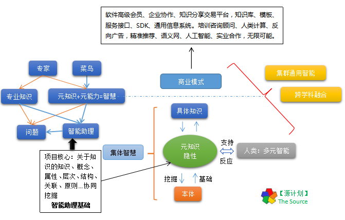

--------------------------------------------------------------------------------
编号: 1
类别: share
文章: 源计划
日期: 2016-7-30 18:00
描述: 社群基本共识
版本：1
作者：ZZH
--------------------------------------------------------------------------------

社群共识
=========

> 热爱胜于金钱：动机、情感、激励；
  发挥群体力量： 分享、合作和集体行动；
  建立网络规则：承诺、工具和协议。

## 简介

【源计划】创建知识之源的计划，从知识管理到人工智能；大道至简，以人为本，开发智能助理工具，社群开放合作共赢、协同积累创新！建立协同认知基础、智能理论、知识库，跨学科融合创新，实现集群通用智能 ，超级生产力及新的关系，革新各行业，高效认知，物质精神丰富，自由平等幸福，开启未来世界！

整体描述：知识经济（背景）、大道至简（统一性）、以人为本（意义），首先扩展个人的能力（工具+协同，社群内部验证），社群开放合作共赢（方式，基于项目学习型），从知识管理到人工智能（战略路线，要实现应对AI，我们需要学习知识也是智能的基础，将来智能也是分布式类人协同的（协同机制），我们是建设训练智能），挖掘知识及智能本质，建立通用语义元、知识体系、智能结构、协同机制（核心根本），目标是跨学科融合创新、实现集群通用智能。发扬传承智慧，自由平等幸福！

## 背景

- 趋势：知识经济、跨学科知识融合创新、人工智能。
- 物质穷+知识精神穷，导致选择困难，不自由！  
- 知识爆炸知识漫天飞重复冗余无效，浪费时间精力，亟需管理。实现智能化管理、建立统一通用的知识体系认知基础！
- 从价值密集的知识大数据中，协同挖掘智能、智慧，制造工具支持，一箭双雕，是最具挑战性最有价值意义的事业，与知识管理行业结合正反馈不断增强。知识是基础，智能核心也要以知识为基础，并需要用知识来训练智能，是必须掌控的战略方向（智能+知识）。
- **协同积累知识，学习不仅是为了积累知识技术，更重要的是自省，探索知识及智能本质，整合知识，形成高效协同机制。从0到1、量变到质变的迭代，知识能力横向扩展纵向突破！**
- 核心理论理论结合社群协同实践工具支持，目的原则战略机制路线管理（正确方向、有效积累）；
- 从知识管理切入人工智能是成本低风险最小、有意义可能性高的一条路，选择人类计算，复杂系统科学为基础、整合借鉴各学科知识经验、形成自己的核心理论及技术。人与人与机器互助协同互助优势互补解决问题，协同创新共享的时代！
- 众筹资本-->众筹智力，信息服务到知识服务，智慧积累传承！

- 信息爆炸、知识匮乏、求知知识过拟合、能力有限、工具繁多、知识分散无结构、隐性知识、有积累但无法高效利用，技能培训需求，学科术语知识体系、跨学科融合问题、知识产权创新中介。找到根本跨越发展。整合形成新的理论。重复劳动，时间精力，亟需有效管理，开发工具支持、实现应对智能。本末倒置缘木求鱼（找到根本）、跨学科领域融合、制造更好的工具（先进技术、辅助），传承智慧静态知识（转换简化引导内化分享），高效学习工作、自由平等高效认知、磨刀不误砍柴工，革新生产力生产关系跨越发展、物质精神丰富！

## 目的意义目标

> 从知识管理到人工智能，协同积累知识传承智慧，高效认知自由发展，促进生产力生产关系的革新，追求自由平等健康幸福！

初期（高效协同学习、自动化智能化知识管理、通用语义元、认知模型、知识体系、可视化智能交互、初步智能理论，协同学习教育培训等问题），研究复杂系统、增强学习、迁移学习、自组织涌现、协同分布式集群智能，普适计算、人类计算、语义网，统计推理迭代渐近，全面语义化自定义个性化。未来方向是集群普适智能，分布式协同智能系统，语义网！促进高效认知，跨学科知识融合创新。形成基于元知识本体论人类计算复杂系统科学的元理论，超级生产力、新的生产关系，革新传统行业！
以人为本、以知识为核心，把语义、认知计算、深度学习应用于知识管理行业形成知识工程的理论方法。分享知识工程、人工智能相关思考、资料、技术、工具。**自由组团**贡献力量，形成高效协同机制，发挥团队力量进行知识发现、训练实现智能，进行深度思考、话题探讨、协同学习、资源整合，集思广益，探索知识及智能本质，促进自由平等高效认知！产出及积累：智能结构理论、知识体系、认知模型、高效协同机制、方法论、知识库、智能助理工具，成立**新人联盟（开放合作共赢自组织的社群组织）**，为智能时代做准备！努力使信息成为活的知识，在社群中快速流动，跨学科领域创新应用，积累传承智慧！  
智能助理工具:面向个人的社群知识协同助理系统，自动化智能化知识管理过程，高效获得知识能力，辅助分析预测决策创新，把人从信息知识爆炸及繁琐重复的劳动中**解放**出来，轻松地爬上站在巨人的肩上，从事更具创造性的劳动，创造超级生产力，形成新的生产关系，物质及精神极大丰富，自由探索创新！  
关键在于：社群协同（人类计算）、统一认识、工具支持、核心技术及理论实践、快速迭代、有效积累可持续发展、理论与实践结合正反馈！

## 定位战略愿景

大道至简，以人为本、扩展人的能力为先，以不变应万变、人类计算，以知识管理为起点切入，社群开放合作共赢，开发个人智能助理工具（面向个人的社群协同知识管理助理，首先在社群内部使用！）促进组织及项目发展，积累知识技术理论，快速迭代、不断整合，重构优化（核心理论、知识库、智能引擎） ，有效积累、持续发展。探索从知识管理到人工智能！挖掘知识与智能本质，最快速实现智能及积累知识的方向！为每个人提供有价值的个性化服务，挖掘整合管理每个人的智慧资源。自由平等高效认知、物质精神丰富、健康幸福快乐。理念：开放合作共赢创新

## 关于知识管理

> 知识如水！知识无价！知识就是力量、知识就是财富！知识是人类进步的阶梯！知识是智能的基础！有价值的是：深度总结、满足个性化、创造性的知识！积累属于自己的知识！  

**知识定义**：此处认为凡能被认知及表达的都是知识。关注认知及知识管理的整个过程。

【知识管理】(KM, Knowledge Management) 是对知识、知识创造过程和知识的应用进行规划和管理的活动。建构一个人文与技术兼备的知识系统，通过收集、整合、理解内化、存储、实践、展示、分享、更新、创造等过程，达到知识不断创新应用的最终目的，并回馈到知识系统內，知识得以永不间断的累积。
知识经济时代，知识取代土地、劳动、资本与机器设备，成为最重要的生产因素。组织和个人的最重要任务就是对知识进行管理。知识管理将使组织和个人具有更强的竞争实力。对于组织和个人，知识管理都已经成为伟大机遇和挑战。--**知识就是财富！**

## 原则

> 以人为本，从心而为，有目的意义原则目标方向战略路线反馈监控，找到根本，不变的地方，不缘木求鱼、迷失在无限个性化、复杂性中。灵活、自由、规则机制、自组织、聚合、涌现、能变更好、可持续发展！人的社会属性、在组织中会被影响、人类逐渐由部落帮派成为利益共同体！

- 目标：探索知识智能本质，开发智能工具扩展能力，超级生产力、新的生产关系，物质精神极大丰富，自由平等幸福！
- 战略：大道至简、以人为本、理论结合实践、从农村包围城市！
- 规则：无规矩不成方圆，管理是为了用最小代价达到目标，有好原则才能更自由。有效积累可持续发展（**能变更好**）。
- 民主：共同定制更好的原则以发挥社群的作用共赢，涌现价值智慧，使组织成为有能动性活的系统，**整体大于部分之和**。
- 发展：可持续发展，**文本化**以更好的积累，方便以后通过工具智能化，迭代完善！
- 素质：思想开放，内向自省，愿学习，改变自己，对生活自然充满好奇，激情，求知若渴，积极主动，善于思考，发现模式，团队协作。项目团队机器人都如此。
- 基本原则：找到根本、防止本末倒置、缘木求鱼、正确方向、战略规划、反馈评估PDCA、SMART原则、KISS原则。敏捷迭代、统一规范但不又不失灵活不拘小节。
- 凝聚：相同的世界观价值观信仰兴趣爱好目的目标需求利益。高效协同。
- 利益：大家都是自由的，自组织涌现智慧，按贡献积分（开发用户都计算贡献），某些超期清零，但都有收益，物超所值。
- 分工：明确自己在系统中的定位：开发 or 用户、理论 or 实践（此处前者包含后者），可转换。开发者是深度用户，还要上升到理论工程层次，实现功能引擎为用户提供产品服务。
- 积累：临渊羡鱼不如退而结网，实干不仅发现问题还要解决问题！形成属于组织的核心理论技术、智慧资产。
- 总之：不忘初心方得始终！ 打开脑洞、feel free to do anything :)
  1. 加速法则：重复工作自动化、简化、重用，工具，重点关键，练习，加速器、启动面板、快捷键、命令行、粘贴板、链接、宏
  2. 专注法则：环境、排除干扰、准备、虚拟桌面、视图、分类、备份、分辨率、字体、工具配置、系统配置、模板
  3. 自动化法则：复用、脚本、工具
  4. 规范性法则：体系结构、版本控制、单一源、规范配置、同步更新、DRY

参考 CMMI 等级：  

1. 初始级，无序混乱的，过程没有定义，成功取决于个人努力，管理是反应式的。  
1. 可管理级，建立基本的过程来跟踪费用、进度和功能特性，制定必要的过程纪律，能重复取得的成功经验。  
1. 已定义级，将过程文档化、标准化，并综合成该组织的标准过程，产品的生产在整个过程是可见的。  
1. 量化管理级，分析对过程和产品质量的详细度量数据，对过程和产品都有定量的理解与控制，能够在定量的范围内预测。  
1. 优化管理级，过程的量化反馈和先进的新思想、新技术促使过程持续不断改进。  

## 沟通

> 传达思想、形成影响

认知基础不同、术语不同、语言的缺陷、也是要解决的问题之一，要互相理解，鼓励经过思考的创造性、建设性意见，**点到为止**。因为思维的不确定性、使用灵活的语言更方便表达，精确的协议反而影响沟通降低效率。但也会随之带来问题，灵活变通、趋利避害是基本，明确自己的目的传达 or 理解，不要浪费时间精力生命！

**共识：**

  1. 兴趣爱好：保持好奇心，不断寻找、做自己最喜爱的事情，才能充分发挥天赋的力量。
  1. 目的意义：做能达到目的的有意义的事情，不要浪费时间精力在错误的地方，有信仰。
  1. 使命责任：使命感、责任感，不止于爱好，还肩负责任。
  1. 团队协作：发挥团队力量，整体大于部分之和，团队强则个人强，互相促进。
  1. 开放共赢：开放思想、海纳百川，利益共同体、共赢团队动力。
  1. 积极主动：主动表达想法、建设性意见。主人意识，自己的团队。
  1. 原则机制：管理是为了最小代价高效达到目标。有原则才能更自由。

  * 基础认识：所有能被认知及表达的都是知识，从基本的感知认知、语义元、知识体系、到世界观价值观，知识管理不仅是知识管理！时间精力注意力甚至是情感的管理，辅助分析预测决策。（用知识管理可能误导了大家，知识工程可能好些）。知识经济：知识知识取代土地、劳动、资本与机器设备，成为最重要的生产因素。 个人知识管理行业，市场空白有先发优势，需求有待开发（但有望超越衣食住行成为高层次强需求，可以用到任何行业），好奇心、求知、活到老学到老！重要的是创造性知识、人生智慧。知识管理+NLP+AI（相辅相成），智能系统建模非从物质形式（如仿生、神经网络），是可基于当前操作系统实现的更高层次的整体抽象智能系统，未来可发展OS，领养自己的智能朋友。可能每一项您都认为是不可能，我们的就是要一步步把它实现！
  * 从个人知识管理切入，关注知识管理的整个过程，更注重挖掘本质根源、关联性、统一体系，基于统一语义元、结构体系的个性化知识智能助理，知识工程实践，分布式智能化的协同学习知识整合创新分享。挖掘隐性知识、方法论、原则、知识的整合自动化、提醒引导、智能交互。时间精力的管理，个人应用接口，探索知识及智能本质，模拟实现类人智能！闭环正反馈递归迭代能变更好可持续。
  * 初期计划0盈利（收获朋友、知识、工具、技能、贡献积分），不接受商业资本控制 ，从根本去解决问题革新突破，相信并探索可能性，从0到1，若能成功就是跨越式发展（颠覆），请相信自己的眼光，从心而为，付出就有收获。按贡献分配，真正的合伙人是一起解决问题，社群是自己的社群 。

- 战略方向路线：

* 明确的是：社群开放合作共赢，是实现本项目的通用知识智能助理相对可行的方式，基于共同的信念利益为自己开发产品，支持协同学习分享平台。集体智慧+多元知识+信息技术=>核心语义元+智能结构+知识图谱库=>AI。 而商业资本需要的是明确的市场痛点现金流，会带来很多约束，开发也是集中式的满足别人的需求，既不能吸引足够多的人参与也不能自由发展，这本身就是在尝试一种新的生产关系（比开源更密切、面向未来）。如何发挥凝聚建设社群是首要任务，发挥团队力量，一个看领导者对战略方向的掌控、资源整合能力，再一个就是大家的积极主动性，贡献智慧，希望每个人都作为合伙人参与，当成自己的一项事业。是基于共同的兴趣信念一个自组织共赢智慧涌现的形式，不是一个人能全面管控的，社群也是项目的产品之一。项目还要继续完善，只要有一个人就不会散，请第一次确认加入合伙的举手（业余协作，第一批有贡献积分奖励！） 贡献积分是个体对组织的贡献衡量，未来分配的主要指标。下一步迭代开始进行具体解决方案设计，试着开发智能核心（元理论+机器学习+本体语义关联理解表示推理生成交互学习）。选择一个方向并可互相学习。机遇：有相对平等的起跑线，适合从头再来，超越的机会！

* 初期整体目标：首先统一认识，开发工具支持成员知识管理（主要是智能交互+知识可视化+协同编辑+知识共享、能力互补、隐性知识、原则方法论（如GTD、整体学习法等）的 显化结构化标准化智能化、形成高效认知学习协同机制（集群智能准备）、真正发挥团队力量（人类计算）），进行知识及技术积累、理论完善。 协同挖掘通用语义元，重建知识体系（语义元+时空+概念层次结构+关联性），智能结构（自省人类能力 ），是从本源上重建系统整体。积累完善技术+理论，为实现更加智能的工具做准备。用具体技术描述就是：结合复杂系统科学+人类计算+增强迁移深度机器学习+分布式+NLP+SDN+区块链+知识工程=智能模拟+语义网+聊天机器人。

* 项目初期还比较简陋，AI本身是一件远、难、坑的事情，我们也是先挖个大坑，坑就是核心竞争力，有挑战才有机遇，就是做别人认为不可能，不能或不愿实现的。有假设有革新赌一把，尽力而为，才有超越的机会。

【长期目标】：实现智能信息处理，知识自动化可视化，认知集群通用普适安全智能！形成核心理论及技术（智能结构、系统物质基础、协同机制、世界观方法论等）。通用智能核心引擎，云知识库及监管平台，语义网络，分布式个性化定制语义终端智能助理，跨学科知识融合创新、知识体系、认知模型。提供：核心知识、交易互助平台、创新中介、行业交叉创新应用、实业，精准反向广告、VIP服务、人类计算平台，形成一个将市场需求与资源结合起来的系统。对比：谷歌提供搜素服务，信息传播。但广告赚钱。我们提供知识工具服务，智慧传承。面向未来钱不值钱，人的时间精力智力资源有价值，实现一半智能就能跨越发展。类似参考IBM认知商业。 这只是一个开始，未来可切入行业：教育、能源、物联网、医疗中医、 航空、金融、磨刀不误砍柴功。以人为本、扩展人的能力、自由平等幸福、物质精神极大丰富、满足需求解决问题。说大一点就是要协同开发工具形成最强大脑、最强组织、革新相关行业，超级生产力、新的生产关系。这只是一个开始，千里之外始于足于下！我们需要一个社群实现，知识足够多，在现有的理论技术基础上资源整合突破创新。

*求同存异、和而不同！*

### 参与贡献

> 相同信念、积极主动、自组织、敏捷沟通分布式交叉合作。开放公开透明，协同机制，自组织、涌现！自由分工，按贡献分配奖励机制！（角色：创始、开发、投资、用户），确认参加的请联系！ 
> 定位、合作形式、社群、权益、机制、原则、开源（后面可能不是）、合伙协议 （核心开发团队）、有原则的、自组织、积极主动。发挥团队力量、提升个人能力，个人具有团队力量，团队提升（循环正反馈）具体分工模块、职能（项目管理、产品经理、架构设计、智能算法、设计开发）（工作组、角色等级权限）自由选择，敏捷迭代，有重点交叉合作，贡献积分，能者居上，贡献者无法踢出，超期无贡献自动退出。共同制定完善规则！

- 【源计划】社群定位
  * 建设基于项目的协同学习型社群，共同的信念、愿景，通过工具、知识需求、兴趣爱好、合作机制凝聚成组织，统一认识，发挥团队力量共同进步积累知识技术理论。开放合作共赢，注重团队建设，组织积累、共同利益为重，产出属于组织个人受益，技术学习练习互助知识分享、形成完善理论、机制。探索新的生产关系，以求创造超级生产力，开发智能助理。每个人都是自由的，任人唯贤、能者高贡献居上，按规则贡献就有回报（智点，至少是朋友知识工具积分钞票智慧，节省时间精力）！找到根本，小米加步枪，从农村包围城市，携手共创未来！会员角色等级权限工作组。核心团队深入本质，开发功能自己为重度用户、普通会员用户使用工具提高能力提出需求建议。团结一切可以团结的力量。前100名送3000永久贡献积分,3年成熟。
  * 【基本要求】：思想开放，内向自省，愿学习，改变自己，对生活自然充满好奇，激情，求知若渴，积极主动，善于思考，发现模式，团队协作精神。项目团队机器人都如此。开放思想、改变自己、价值意义导向、从心而为。积极主动、真诚交流、协同并进、自组织、自由分工、智慧涌现、利益共同体、按贡献分配奖励，勇于创新、知足常乐、适可而止、记得感恩、懂得珍惜！
  * 【主人翁意识】自己的组织、利益共同体。是自己的组织（开发合作共赢，是扩展自己能力的团队首先要建设好团队），能力互补分工协作。找到自己的定位，互助实现梦想。不断统一认知、磨合、形成默契。个人与组织共同成长。我们做的产品就是如何高效协同认知积累，扩展增强能力，整合挖掘利用每个人的智力资源，首先是在团队内验证解决问题、团队成员受益。时代使命感责任感，先下手为强、抓住机会！
  * 【重点】学习是为了获得元知识（本质、关联、融合）以智能化认知模型，自省认知学习能力（模仿人的智能），技术储备，人才吸引，探索高效协同机制（分布式），从0到1、量变到质变的迭代。
  * 【关键】共识、信念、愿景、在于产品的目的价值意义的认可：以人为本、从知识管理到人工智能，面向个人的社群协同知识管理分享，扩展人的能力，探索知识与智能本质。厚积薄发，先整合再化繁为简形成理论再创新生产！
  * 合伙协议、组织章程

- 建模方法论（集体智慧+机器学习=人类计算，建立循环迭代完善模型）
[]

- 分工：

  * 资料整理（项目说明、商业计划、社群共识、合伙协议、组织章程、开发及管理文档）、项目管理 、产品定位、业务建模、需求开发 、功能路线、系统分析设计原则初步理论、架构分析设计、技术路线 、接口UI设计、交互设计、类似产品、开源参考、编码开发。
  * 已在GitHub建立开源项目[kmagent]( https://github.com/GYGit/kmagent)，采用GPLv3开源协议，添加项目简单说明。欢迎参与提出各方面补充、修改、建议、开发等贡献！

  * 对项目开发者合伙人来说需要深入知识及智能本质（选择自己的职能或技术或功能等等），大家也可以选择做用户（提需求、问题、用工具就可以了，整理知识也是贡献）。开发：面向协同个人知识管理的聊天机器人（智能助理）（PC+CS+BS+大数据语义web知识挖掘）。个人能力有限，想参与开发的都可以进行业务建模、产品设计、架构设计、技术选型等各方面工作。合作请告知！

- 工作组协同体系

> 分不同的工作组，在项目文档中，功能、技术、职能、学科、产品参考、开源参考等已列出很多点可参考，大家可以按自己的兴趣爱好选择，甚至是中医也可作为一个，但要基于共同的目标信念：开放（思想开放、社群开放、技术架构等），合作（沟通协同一致 ），共赢，集体智慧，多元融合创新，整合并制造工具扩展。这样社群就可以让各方面人才参与（技术or领域专家or新手），可以专注于自己感兴趣的方向，贡献智慧（技术应用、领域知识整理、模式融合、核心算法，沟通协调等），核心工作组：中介沟通管理核心架构理论的，聊天机器人组：应用开发。各工作组，要以个人知识管理应用为中心（整理知识、开发or学习），协同互助，自省、发现模式并整合，促进核心理论的完善（语义元、通用知识体系、智能结构），整体解决方案及工具开发。先入群的了解该形式的优先为组长，创新挺难的，也是在探索可能性。

  目前以个人知识管理应用协同平台为中心。可以选择加入或自立工作组。
  第一个工作组：目前我一个人（主要是相关文档编写、社群建设、战略方向、知识管理业务建模、沟通协调、模式发现、知识整合、核心理论、做别人不想做或认为不可能的事）继续迭代。
  第二个工作组：聊天机器人（先行起点，面向个人知识管理、开发自己想要的功能(自己就是用户)，提出更具体的技术知识需求，与其他组互助，技术积累，可能概念比较大后面可拆分），随时欢迎参与！

- **提醒**

  * 新手及专家（类似初创和大公司）：新手出生牛犊不怕虎，具有更多可能性灵活性（有利于自省学习能力，更多选择性），缺乏经验，三个臭皮匠赛过诸葛亮，想高效学习积累请参与本项目；专家有积累优势，但易过拟合思维定势，顾虑，想解放大脑请参与本项目，建立体系分享给新人后代。都要要开放思想、谦虚好学、结合互补纵横扩展。

- 架构设计

  * 语义本体建模+知识库、语义网、知识图谱+智能结构+环境+功能：逻辑视图，空间结构、概念层次建模。自组织活性
  * UI+智能交互+知识管理建模+智能助理功能模块：应用场景
  * 处理逻辑+GTD+交互：过程视图、能动性、智能
  * 系统架构实现+技术选型+分工合作：开发视图，实现
  * 分布式协同系统+功能划分：部署视图。

- 顺序路线

  * idea 完善：起源初心概述，相关主题文档整理。
  * 统一认识：愿景、价值意义、术语、根本目的、基本原则、战略方向、话题引导。
  * 合伙协议章程：组建核心团队，社群共识，高效协同机制、自由分工、自组织智慧涌现。
  * 商业计划书：市场行业、用户定位、产品服务、商业推动、运营管理、营销推广；
  * 产品开发：需求功能列表、设计思维、技术路线、架构设计。知识智能助理工具。
  * 初步理论：发现模式总结整合形成核心理论（基本原则、术语定义、认知模型、知识智能本质、框架模板）。
  * 人类计算：ren，充分挖掘利用人的智能，能动性、生态系统、递归迭代正反馈，智能化。
  * 类人智能：智能基础、智能核、智能模块、智能体、群体智能、通用智能，模拟->超越。

- 按职能

  * 资料整理（项目说明、商业计划、社群共识、合伙协议、组织章程、开发及管理文档）、项目管理 、产品定位、业务建模、需求开发 、功能路线、系统分析设计原则初步理论、架构分析设计、技术路线 、接口UI设计、交互设计、类似产品、开源参考、编码开发。
  * CEO：原则战略方向，品牌建设、文化理念、社群运营、全面掌控决策。
  * TODO：项目启动会（共识、协同）、概要设计（业务需求建模、最简解决方案、技术选型等）。
  * 项目管理：原则战略方向、沟通协调、配置管理、团队建设、协同机制、过程改进，最小代价满足需求，简化但不是最简。
  * 产品经理：需求分析、智能交互、知识管理行业、市场行业分析、类似产品、功能列表、UI。
  * 架构设计：平台架构、功能分析、架构设计（功能性能）、技术选型、编程语言、开源项目参考。
  * 智能算法：建模、核心算法、NLP、深度学习、分布式。
  * 设计开发：功能算法设计实现、测试、集成、运维。
  * 智囊团：领域专家、经济学原理、哲学、方法论（思维导图、GTD、CMMI、TRIZ...）、创新思维、NLP（神经语言学）、认知心理、人工智能哲学、成功学、国学、基础学科

## 起源

[关于起源](./origin源-仅备份log.md)

初心：一直以来学习工作中，都有知识管理（是全过程：学习理解沟通表达）需求，以前没意识到可以作为一个伟大事业。最近想做点人工智能的东西（成家立业，好多知识要学，但效率太低，时间精力能力有限，工具不好用），怎么办，寻求合作帮助，制造工具，这应该是最简单的第一反应。前面感觉讲了一堆大WHY，只是特别想大家知道为什么做目的愿景价值意义信念，但其实不仅是愿景，也有具体的，可是大家都被那些吸引了，说明内心还是有小宇宙，人工智能是很难实现的，只有从根本上突破才有希望，超越。但也不一定要实现AI，重心是专注【知识管理--隐性知识】这个领域，成为行业专家。就算最终从物质材料、神经科学实现了智能（成本高风险大），知识也是必须的（对人及智能）。在一些文档里也用了自己的一些知识管理想法，结构层次概念术语，若仔细看应该有所体会（就像所有书或文章背后都有更多的知识能力在支撑），即隐性知识、关联及体系等。个人也有试着提炼、但就算正确也是片面的，希望能集思广益，形成公认或者说2个人共识再能让另一个接受（需要3个人，多多益善），基于此可以作为基础，不断迭代扩展，支持无限个性化。说到底就是想做个知识管理工具提高工作学习效率，说好听了就是个人智能助理、聊天机器人。还有提醒大家我不是搞研究的是搞实践的程序员，能力也一般请，虽然写了很多远景理论假设，说明对本项目的用心，希望项目能快速发展，这需要大家的智慧通力合作，实现愿景。 既然要做，就做大，全力以赴。找对方向合作持续积累（人生有限、方向选择太多，如果您还没定，建议参考该方向，巨大社会价值、无限可能性，值得奋斗终生）。所谓工匠精神，就是尊重你的事业工作，并把它做到极致（目标集群通用智能、跨学科融合）。把一件小事做到极致，平凡的你将变得不平凡！加油！大家一定要开放思想、积极思考、每个人都有其智慧，不要压抑控制它，让您的智慧涌现吧。方法总比问题多，一切皆有可能！ 从心而为、成为自己！

## 话题

> 鼓励提出相关话题进行讨论，深度思考、提问的智慧。

知识管理及人工智能相关话题讨论，分享相关技术、新闻、文章、书籍、思想等信息。  
1、知识定义；2、你最想传给后代（永生）的知识是什么，教育目的（学习知识能力，在前人经验基础上，更好地自由认知发展成为自己。）？3、语言与思维、语言的缺陷；4、大脑、意识、生命、智能；5、智能受时空限制吗？ 智能层次与时空的关系。6、通信协议、形式语言、通用语言=通用智能？智能是语言的基础，中文英文对比优缺点！自定义语言，xml；7、人拿杯子的过程：预测决策控制的递归迭代。 一切发展都是**递归迭代的过程**！ 8、人工智能活着的意义（以人为本->生存->欲望，如何判断它已超越人的智能情感，）  
数据--统计--信息  
知识--推理--预测<->决策--智慧  
学习--积累知识经验--知识库、智囊团  
表达理解交互、递归反馈迭代  

## 能力

> 自省、化繁为简、发现模式的能力

多元智能，每个人都有最强大脑，发掘利用训练自身智能。  
知识是：所有可认知并表达的信息，意识、能力=>知识；  
智能是：知识引擎；智能的本质及基础：物质+结构+规则+涌现？  
元知识是知识的球心。元能力是智能的球心。核心引擎驱动在统一结构上实现。  
元知识+元能力+智能核+统一结构+物质基础。具体学科知识存储、可视化、智能化应用  
自组织、生命（活）、能动性。

## 理论

- 总结形成元理论：包含指导形成世界观价值观方法论的理论、智能与知识核心本质基础、社群协同机制、大道至简探索在某个层次统一的大统一理论，完美不存在、但要追求完美！
- 元按规则关联导致混沌展现模式涌现智能，统一知识能力结构，元=整体，迭代递归。
- 基本元-->智能核-->智能体-->集群智能-->通用智能。神经网络是基础++智能核心元智能+多元整体智能+集群智能+知识
- 元 > 层次结构类别 > 模块化 > 互转换 > 自组织 > 自适应 > 自完善 > 自知自省 > 自定义 > 个性化 > 能动性 > 创造性，- 与环境交互、生态系统！统一、显性化、标准化、结构化、流程化、智能化
- 如何融合分布式、体系框架模板、精简冗余、博大精深、模式混沌、确定不确定、理性情感、原则策略、有限无限、灵活固定、精确模糊、定制量产、统计推理、归纳演绎、抽象具体、对与错、物极必反、过犹不及、适可而止。五度空间、互转换、正反长短、显隐、量变质变、时域频域、模拟数字、相对绝对、解决自指悖论，发挥系统活性，涌现智能生命。

## 工具

> 制造和使用工具，扩展能力！你不是一个人在战斗、学会需求帮助！  
“君子生非异也，善假于物也”--《荀子·劝学》

人工智能：知识+能力=智能；带来生产力变革、无限可能！  
工具开发：借助智能助理工具简化自动化支持，轻松扩展个人能力，真正发挥团队力量，促进知识经济时代的知识整合应用创新传承！  

工具推荐：思维导图、GTD、笔记、自动化重复工作。。。

## 相关术语、学科及技术
知识经济、知识管理、知识工程、个人智能助理、复杂系统科学、人类计算、社群共享体验经济、内容创业、大统一理论、专家系统、人工智能、机器学习、深度学习、模式识别、自然语言处理、大数据、云计算、语义网、知识发现（数据挖掘）、游戏化、可视化、思维导图、区块链、GTD、TRIZ、SDN、软件工程、UML、项目管理、过程改进(CMMI)、面向对象、服务、智能体、集群智能、3D打印、标准化、开源精神、ERP、BI、占意（注意力）、数学危机、混沌、不确定性原理、不完备性定理、ODP(Open Directory Project开放目录工程)、wiki、百科、知识图谱、跨学科知识融合、格式塔心理学、脑神经科学、语义计算、超循环。认知心理、信息技术及软件工程、分布式、虚拟化、计算社会学经济学。

## 术语
统一规范术语、统一认识、首先是基本元、关系、甚至是出字典。

## 切入点

> 找到根本有效积累，而不是缘木求鱼，不断聚焦，追问why及how，第一步是不断明确聚焦具体化想法（思想、原则、理论、战略、路线）并表达出来，以求合作快速发展！智能如何自学习知识成为专家或者辅助人学习积累知识！

**个人智能助理**，市场相对空白、自动化智能化可视化知识管理的整个过程，协同积累分享交易知识，基于统一的知识体系、元知识、元方法，个人智能助理，以更好的整合管理具体个性化的知识，有效利用节省时间精力注意力，辅助分析预测决策创新应用，知识银行；智能体、语义网终端、最理解了解你的定制化助理、挖掘传承你的智慧、私人专家顾问智囊团、老师、朋友、宠物；专家问答系统（以基本常识为基础的挖掘隐性知识、专家具体知识库）；智能客服；企业信息系统：知识管理、ERP、BI、IE、工业4.0物联网智能集成系统；程序化量化投资、高频交易，财务金融证券信息顾问服务。翻译、NLP；微型机器人组成大白。人机智能交互，默契（互相了解共同语言）、自然语言处理、生成式界面、人机区别、VR/AR。文章简化摘要、普适计算通用智能。 **数学在线教育**，超越英语；数学算是最精准的知识！简化数学通俗易懂，不仅是知识 or 应试，训练思维能力，解决问题的方法论，循序渐进，终身收益！打好基础扩展思维。是有价值意义的事情，可持续发展的，而不是财务金融证券。所有人都可以快速理解应用数学。与知识管理、知识工程、认知科学、人类计算（社群）、游戏化、可视化、人工智能等新技术结合，个性化定制的数学语文教育，国学智能教学！

周末受启发，有个商业项目，可考虑一下（拼学），组队一起学习，有互动，学习工作问题互助，内荐招聘等，加上源计划的一些功能（知识管理，知识可视化，学科知识图谱，NLP文本交互），可以再想想/::)。拼学，强调更强参与感积极性的互动在线教育，两个人或多人可以基于同一个课程图谱互助学习，我们以此为主打概念可以再提供一些其他服务，只是想法，还没想如何盈利，可以思考对比一下市场上的在线教育，看是否可行

**您的建议**：1...

- 极简商业计划书：

  * 以人为本，从知识管理切入，开发智能助理工具，社群协同建立认知基础，建立知识体系，提供工具及服务。通过人类计算（社群共赢）的方式，借鉴复杂系统科学方法论， 发展完善智能理论（元理论：元规则关联混沌模式递归迭代） ，促进跨学科融合创新，实现集群通用智能（分布式协作集群、自学习、个性化） ，超级生产力及新的关系，革新各行业，高效认知，物质精神丰富，自由平等幸福，开启未来世界。

- 从上到下

  * 新生产力及关系，革新各行业，物质精神丰富、自由平等幸福、未来世界（永生宇宙意义）！
  * 普适通用智能=知识+智能引擎。
  * 顺势而为，信息技术，迭代积累、持续发展，有效积累、学科融合、知识经济；
  * 以人为本，探索知识及智能本质，模拟人类智能，扩展人的能力。
  * 通用语义元，知识体系，智能结构，复杂系统科学：涌现、整体大于部分之和 =元理论
  * 社群协同、人机协作、优势互补，高效协同学习工作，按贡献分配、社群开放合作共赢。=人类计算
  * 认知模型、知识体系、知识库、工具、规范、原则、方法、策略、管理。
  * 解决知识就是财富、知识爆炸、知识掘金、分享交易等问题
  * 知识管理、知识工程、协同总结，简化自动化智能化、时间精力注意力资源管理
  * 知识管理=信息技术+社群分享：放大。
  * 始于一个想法，相同的信念，迭代渐近，闭环正反馈！

## 书籍推荐

  《金字塔原理》 《智能的结构》 《知识大通融》 《思维导图使用手册》 《如何高效学习》
  《一个定理的诞生》 《认知心理学》 《知识系统工程》 《学记》 《少有人走的路》
  《人工智能：一种现代的方法》 《情感机器》 《人工智能》（史忠植）
  《哥德尔、艾舍尔、巴赫书：集异璧之大成》 《复杂：诞生于秩序与混沌边缘的科学》
  《世界咖啡：创造集体智慧的汇谈方法》 《计算主义：一种新的世界观》 《隐藏的逻辑》
  《linux/unix设计思想》 《卓有成效的程序员》 《本体建模与Web知识发现》 《多米尼克的记忆魔法书》
  《从0到1》 《创业者手册》 《第五项修炼》 《独力企业》

## 参考  

[如何发起一场运动](http://open.163.com/movie/2011/7/9/T/M7B9KH4N6_M7BA9TF9T.html)--TED视频时长3分钟  
[为了自己](http://open.163.com/movie/2011/7/0/A/M78065A8E_M7806OF0A.html)
[中文编辑排版](http://mazhuang.org/wiki/chinese-copywriting-guidelines/)  
[提问的智慧](http://www.jianshu.com/p/60dd8e9cd12f)，这个有点长！！  
【GitHub项目托管】/[GYGit](https://github.com/GYGit)  
[网站 'http://kmagent.com'](http://kmagent.com)。  
联系： **【qq群】：13679059**  

## 功能需求

> 对知识管理平台、工具的要求，功能点列表

开发工具集成知识管理的整个过程各种功能（收集、整理、内化、分享、创新、应用；分布式可扩展自适应自学习；集成编辑器、印象笔记、wiki、钉钉、思维导图、可视化、知乎、区块链、GTD、PM、CMMI、无限灵活定制化的通用智能系统！）

## 商业模式

> 价值观：劳动创造价值、满足需求解决问题、物依稀为贵
- 价值意义导向。社群运营、知识管理产品服务平台，通过智能工具提供服务。从最底层根本开始的资源整合、创新应用。规划设计、证明、实践、完善形成闭环正反馈。
- 如何分布式协同分工，效率不断提升，不可替代性，形成壁垒，唯一整体。
- 基本原则就是：开放合作共赢、自组织、透明公开、隐私、安全、知识产权；组织共享、利益共同体！强关联、强需求离不开组织！
- 社群内部优先分享 **共赢** （知识技能工具产品），**有多少人干活就有多大市场**，关键看你干不干，实名登记前10000终身半价，送1000积分。前期加入受益，后期加入收费！
- 简单统一原则自发自组织、按贡献分配（回报>=付出）、安全交易。发挥能动性融合知识精华、报酬递增！要设计好机制，自由定位分工，有凝聚力、积极性、更好的涌现智慧，集中发挥团队力量改变生产关系、创造超级生产力！
- 初期很容易做贡献（定规则、一句话、代码、人、技术、资本）简单，后面就不容易了，加入要学习遵守规则，积分获取变困难。
- 明确各自定位，核心开发团队与用户分离；开发也是用户，但用户不需要参与了解实现细节！
- 每个努力的人都有平等的机会成功！但先下手为强，前人种树，后人乘凉！
- 知识库：汇集积累信息、知识，把知识贡献给组织（加积分）统一管理，后期创造性个性化知识可交易！平台建立统一知识库、个人有个性化知识库！
- 智囊团：分类分级分组的智囊团、咨询；但统一属于组织！
- 品牌文化，以知识、智能为基础，开发工具联合社群，造超级生产力，提供高品质产品服务、跨学科创新中介、行业革新、自给自足，物质精神丰富，自由快速可持续发展！

## TODO

1. idea 完善：起源初心概述，相关主题文档整理。
1. 统一认识：愿景、价值意义、术语、根本目的、基本原则、战略方向、话题引导。
1. 合伙协议章程：组建核心团队，社群共识，高效协同机制、自由分工、自组织智慧涌现。
1. 商业计划书：市场行业、用户定位、产品服务、商业推动、运营管理、营销推广；
1. 产品开发：需求功能列表、设计思维、技术路线、架构设计。知识智能助理工具。
1. 初步理论：发现模式总结整合形成核心理论（基本原则、术语定义、认知模型、知识智能本质、框架模板）。
1. 人类计算：充分挖掘利用人的智能，能动性、生态系统、递归迭代正反馈，智能化。
1. 类人智能：智能基础、智能核、智能模块、智能体、群体智能、通用智能，模拟->超越。

## 总结

> 知识经济，以人为本，灵活、自由、规则机制、自组织、聚合融通、涌现！社群协同、统一认识、工具支持、核心技术、理论与实践正反馈，有效积累、能变更好、可持续发展！  

“高上尊贤，无以骄人；聪明圣智，无以穷人；资给疾速，无以先人；刚毅勇猛，无以胜人。不知则问，不能则学。虽智必质，然后辩之；虽能必让，然后为之。故士 虽聪明圣智，自守以愚；功被天下，自守以让；勇力距世，自守以怯；富有天下，自守以廉。此所谓高而不危，满而不溢者也。”--《敬慎》  
千里之行始于足下、不积跬步无以致千里。君子生非异业也，善假于物也！  

要越过知识这道高墙，只能通过两种方式。一是让所有人都具备攀爬的能力，也就是让大家都成为全科博士，但这显然不可能。二是由具备能力的人翻过这道墙，把里面的知识取出来，用平易的方式介绍给普通人。第二种方式是可行的，也是“政见”团队一直在做的。从2011年11月到现在，是用这种方式，拆掉横亘在普通人和学术知识之间的高墙，让用公共资源支持的学术成果，真正为公众所接触和了解。就像科学松鼠会致力于剥开自然科学的坚果一样，他们试图拆掉社科知识的高墙。  
- 【源计划】双管齐下、想翻过的是协同、认知、知识体系的墙，并以智能工具辅助拆掉人文及科技之墙，高效认知及精神自由，智慧涌现传承应用创新。
- 【源计划】创建知识之源的计划，从知识管理到人工智能；大道至简，以人为本，开发智能助理工具，社群开放合作共赢、协同积累创新！建立协同认知基础、智能理论、知识库，跨学科融合创新，实现集群通用智能 ，超级生产力及新的关系，革新各行业，高效认知，物质精神丰富，自由平等幸福，开启未来世界！

请不吝赐教，一起完善！并开发工具自动化支持以创造普遍价值扩大影响力！  

标识 Logo：
标记 mark: 

  
本作品采用 CC-BY-SA [知识共享署名-相同方式共享 3.0 中国大陆许可协议](http://creativecommons.org/licenses/by-sa/3.0/cn/) 进行许可。

> *千里之行始于足下、不积跬步无以致千里。君子生非异业也，善假于物也！*  
> *最深刻的思考，最精简的知识，最智能的工具，最高效的协同，传承智慧创新未来！*  